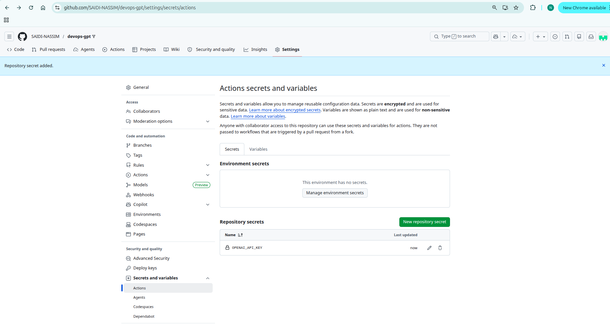
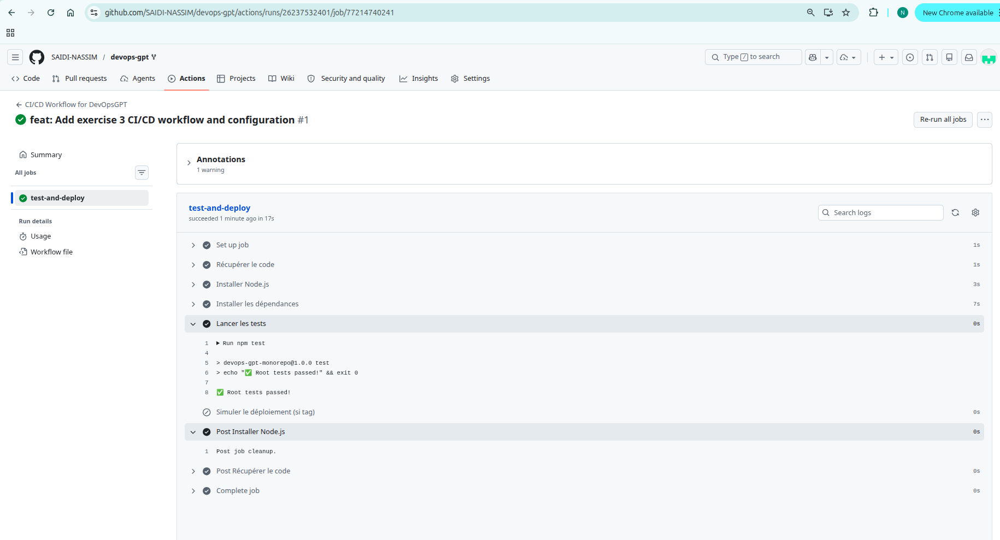
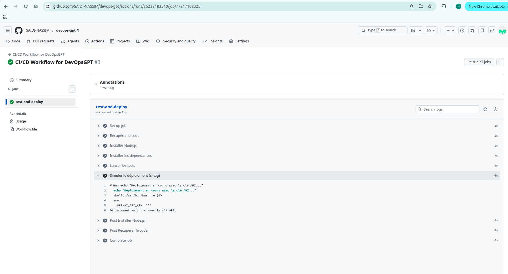

### Exercice 3 : CI/CD avec GitHub Actions

#### 1. Le Workflow CI/CD

Le fichier de workflow `main.yml` a été créé dans le répertoire `.github/workflows/`. Ce workflow automatise les tests et le déploiement de l'application.

**Déclencheurs :**
-   **`push` sur `main`** : Chaque fois que du code est poussé sur la branche `main`, le workflow s'exécute pour s'assurer que les modifications n'ont rien cassé.
-   **Création d'un tag `v*`** : Lorsqu'un nouveau tag de version est créé (ex: `v1.1.0`), le workflow exécute les tests puis procède au déploiement.

**Étapes du Job (`test-and-deploy`) :**
1.  **Récupérer le code** : Utilise l'action `actions/checkout` pour avoir accès au code du dépôt.
2.  **Installer Node.js** : Configure l'environnement avec la version 22 de Node.js.
3.  **Installer les dépendances** : Exécute `npm install` pour installer les paquets nécessaires (comme `jest` ou d'autres dépendances de développement).
4.  **Lancer les tests** : Exécute `npm test` pour valider que le code est fonctionnel.
5.  **Déployer (conditionnel)** : L'étape de déploiement (`echo "Déploiement en cours..."`) ne s'exécute **que si** le workflow a été déclenché par un tag de version.

#### 2. Sécurité et Secrets

**Question A : Où enregistrer un secret sur GitHub ?**

Pour enregistrer un secret comme `OPENAI_API_KEY` de manière sécurisée sur GitHub, il faut suivre ces étapes :

1.  Aller sur la page principale de votre dépôt GitHub.
2.  Cliquer sur l'onglet **"Settings"** (Paramètres).
3.  Dans le menu de gauche, naviguer vers **"Secrets and variables"** > **"Actions"**.
4.  Cliquer sur le bouton **"New repository secret"**.
5.  Entrer `OPENAI_API_KEY` dans le champ **"Name"** et coller la valeur de votre clé dans le champ **"Value"**.
6.  Cliquer sur **"Add secret"**. Le secret est maintenant stocké de manière chiffrée.

Voici une capture d'écran illustrant l'interface de création de secret :



**Question B : Syntaxe pour utiliser le secret dans le workflow**

Pour injecter le secret comme variable d'environnement, on utilise la syntaxe `${{ secrets.NOM_DU_SECRET }}`.

Nous avons appliqué cette syntaxe directement à l'étape de déploiement dans notre fichier `.github/workflows/main.yml` :

```yaml
      - name: Simuler le déploiement (si tag)
        if: startsWith(github.ref, 'refs/tags/v')
        env:
          # La clé API est injectée ici depuis les secrets GitHub
          OPENAI_API_KEY: ${{ secrets.OPENAI_API_KEY }}
        run: echo "Déploiement en cours avec la clé API..."
```

#### 3. Preuve d'exécution du Workflow

Voici une capture d'écran montrant l'exécution réussie du workflow sur l'onglet "Actions" de GitHub après le push sur la branche `main`.



De plus, voici la preuve que l'étape de déploiement s'exécute bien lors de la création d'un tag, comme le montre le workflow déclenché par `v1.0.1`.


